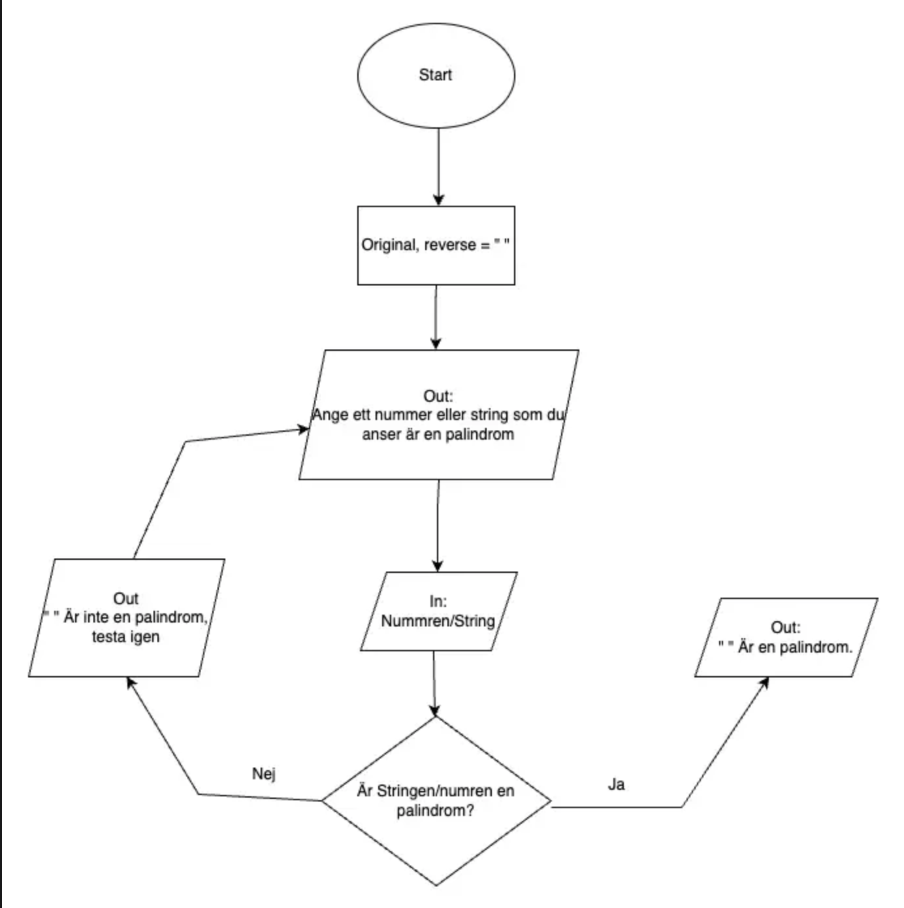

# flodesdiagram

Ett skolprojekt där en grupp av 4 ska skapa ett program utifrån ett eget flödesdiagram
som gruppen hjälps åt att skapa.

Programmet CheckForPalindrome ska ta emot en sträng från användaren och sedan kolla om 
strängen är likadan som om den skulle skrivas baklänges, exempelvis otto. (Palindrom)

## Flödesdiagram

https://drive.google.com/file/d/1SVR7WcKlLrKAchANb9nMR2EV_f5AtL4i/view

